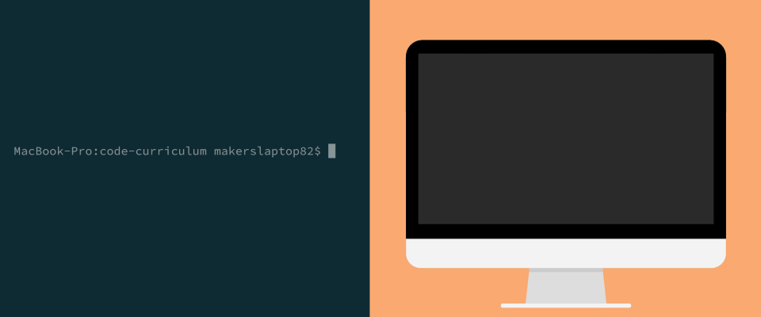

# Exploring the World (Variables and Statements)

### Where we're going

We're going to build a numeral calculator. It'll work just like a normal calculator, except we'll be able to use numerals (English words representing numbers) to do basic maths. Something like this:

```irb
> one + two
=> 3
> four * five
=> 20
```

### Introduction

We know now that typing `irb` into the console starts a REPL: the computer sets up a Ruby world, and we, the user, get the ability to write Ruby code to modify that world on-the-fly.



You might think this world starts off empty: but it doesn't.

## What exists inside a Ruby program?

When the Universe began, the great computer in the sky ran a 'Universe' program, and created the Universe. It also created some denizens for that Universe: the moon and stars. 

When our computer sets up a Ruby world, it creates a Universe ('main program function'), and it adds a bunch of useful denizens to it. In Ruby, we call these denizens 'objects'. One good example of such a 'pre-created' object are _numbers_.


Every object that's created:

* Knows something about itself, and
* Knows how to interact with other objects.

For numbers, each number that's created:

* Knows how much it's worth, and
* Knows how to interact with other objects (especially other numbers).

<gif demonstrating numbers linking to other numbers to interact. Use 'flow of information' lines to differentiate from pointers>

We can interact with these numbers in `irb`. Start `irb` from the console. Then, to call up a number:

* _**Type an instruction. In this case, we want to ask the program to read a number. So, we type `1`.**_
* _**Send your instruction to the program world by pressing 'Return'.**_

<details>
<summary>See how I'd do this</summary>
<p>

```irb
> 1
=> 1
```
</p>
</details>
<p></p>

> This 'type your instruction' followed by 'send your instruction to the program world' pattern is the basis on which all coding happens.

Let's try this again with another number:

```irb
> 2
=> 2
```

What just happened? We went into the program world, and asked for the number 2. The world fetched the number 2, and **returned** it to us.

<gif of irb executing code and the world retrieving and returning the number 2>

## What doesn't exist inside a Ruby program?

Shortly after the Universe began, the moon and stars came into being. But, it was a while before trees, dogs, human beings and cars showed up. What _doesn't_ exist when a program world is created?

Let's try to ask the program world for something non-existent. 

* _**Start `irb` from the console.**_
* _**Then, try to ask for something called `one`.**_

<details>
<summary>See how I'd do this</summary>
<p>
  
```irb
> one
=> NameError: undefined local variable or method `one' for main:Object
```
</p>
</details>
<p></p>

Ugh. That looks tricky. But let's take a minute to understand what the world's trying to tell us:

<image guide: decompose an error message>

In short, the program world is saying "you asked for something called `one`. It doesn't exist, as far as I can see."

So why does `1` exist and `one` doesn't? This is a choice the creators of Ruby made. They believed that plenty of people would want to use numbers using the [glyph](https://en.wikipedia.org/wiki/Glyph) form `1` (or `2`, `3`, and so on). They believed that few people would want to use the numeral form `one` (or `two`, `three` and so on).

Bad news for them, then: that's exactly what we want to do. To do it, we're going to have to create something inside our program world: a **name**. Then, we're going to point our name to the number object that already exists.

## Giving names to things

Since a Ruby program is your own Universe, you get to choose what things are called. This is called **naming**. 

> Naming is a big responsibility for a programmer. It's hard to give things sensible and meaningful names, so other users of the world (including other programmers) can manipulate the world without becoming confused by what things are. A lot of wasted programming time can be traced down to choosing a bad name for a new object in a program world.

One way to give an object a name is to make a label for it, and attach the object to that label. These labels are called **variables**, and the process of attachment is called **assignment**.

<gif of setting a variable as a pointer>

Let's try this out. 

* _**Open `irb`, and give the object `1` another name: `one`.**_
* _**(_In other words_: define a variable `one` that points to the object referenced by the name `1`.)**_

> In Ruby, we use `=` to point names at objects. It's called the **assignment operator**.

<details>
<summary>See how I'd do this</summary>
<p>

```irb
> one = 1
=> 1
```
</p>
</details>
<p></p>

Whenever we ask the program world for the variable `one`, it will return the object that variable is pointing at:

<gif of asking the program world for a variable and grabbing the object via the pointer. Use 'bound' lines to differentiate from flow-of-information>

Let's ask the program world for the object pointed to by the variable `one`:

```irb
> one
=> 1
```

Nice! Now over to you: define names for:

- _**`2` through `10`, and**_
- _**as many numbers as you want until you get the point.**_

<details>
<summary>See how I'd do this</summary>
<p>

```irb
> one = 1
=> 1
> two = 2
=> 2
> three = 3
=> 3
...and so on
```
</p>
</details>
<p></p>

## Making objects interact

I mentioned earlier that numbers know: 

* how much they're worth, and 
* how to interact with other numbers. 

Here's an example of that in action in `irb`:

```
> 1 + 2
=> 3
```

In the case above, here's what's happening. The computer executes the code `1 + 1` character-by-character:

- The program world fetches the object referenced by the name `1`.
- The program world asks the object referenced by `1` if it understands the message `+`. 
- the object referenced by `1` says "yes, it means 'add the value of whatever number object comes after'".
- The program world fetches the object referenced by the name `2`.
- The first object referenced by `1` adds the value of the object referenced by `2` to itself. The result is returned to the program world.
- The program world returns the result to the user: `3`.

Here's the above, visually:

<gif of the program steps involved in the statement above>

We call an expression like `1 + 2` a **statement**. (We did a statement earlier, too: `one = 1` is a statement).

Since our variables `one` through `ten` (and possibly more) have already been defined, and point at the objects `1` through `10`, we should be able to get our numeral calculator working straight away.

* _**Make the numeral calculator work in the REPL.**_

<details>
<summary>See how I'd do it</summary>
<p>

```irb
> one + two
=> 3
> four * five
=> 20
```
</p>
</details>
<p></p>

## Loading pre-written worlds

We already know that closing `irb` will result in the program world being destroyed – and next time we start `irb`, it'll be a fresh new world. All the names we declared won't exist any more, and we'll have to start over from scratch.

What a pain! So do we have to type our instructions from-scratch every time we start a program? Of course not. We can use a **file** to store the instructions we would have to type into the REPL each time, and **execute** the file automatically when we create the world. This will give us the world we want – containing the names we've already made – and the REPL can provide an interactive window into that world.

<gif of world being created from a file>

To move your instructions into a file, we must make a Ruby-specific file (just as a Microsoft Word document has the file suffix `.doc`, so Ruby has the suffix `.rb`), and then write our instructions into it, just as we would the REPL:

1. _**Create a Ruby file. We could call the file `variables.rb`, since we're going to store our variables inside it.**_
2. _**Open this file in a text editor, such as [Sublime Text](https://www.sublimetext.com/).**_
3. _**Assign variables, named after numerals, to all the number objects you want to use in your calculator: just as you did in the REPL.**_
4. _**Save the file.**_

We can use `irb` to first set up a Ruby world, then immediately load this file to set up our names (so we can use them in the REPL straight away).

- Make sure your command prompt is in the directory to which you saved `variables.rb`. 
- Start `irb` using the command `irb -r variables.rb`.
- Use the numeral calculator without defining variables in the REPL.

> There are two ways we can start Ruby programs from the command line. We already know about `irb`, which runs the program and then gives us a window into it. You can also use `ruby variables.rb`, which just runs the program, and then exits the program – destroying the world.

> I've lied a bit about how numbers work in Ruby. Numbers aren't actually created at the same time as the main program function. In reality, an smaller, sub-world (a 'function') is created. When we type `100`, that function is executed in such a way as to return the number 100 to the world on-the-fly. It's a small distinction: but why does Ruby do this klind of on-the-fly generation? The answer is: this is a way to avoid slow program start-up, where the program has to generate loads of numbers before it can show the prompt. The reason we're not covering this in detail here is because this function isn't actually a Ruby function: it's a C function, which Ruby executes. You can learn more [here](https://stackoverflow.com/questions/3430280/how-does-object-id-assignment-work) if you're interested.
